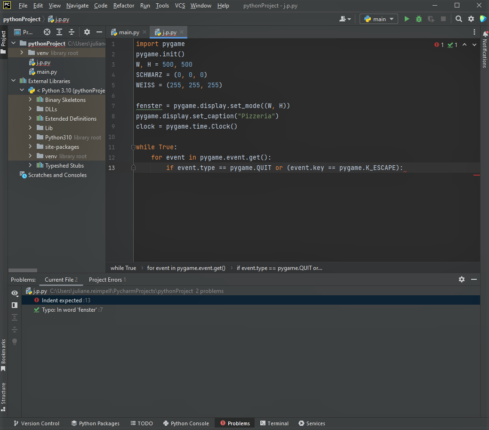
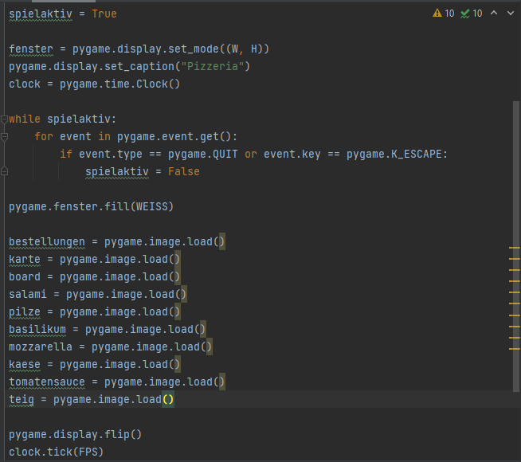

# Arbeitsprotokoll-2

### 10.01.2023
Heute war die erste Stunde nach den Weihnachtsferien. Wir haben zu Beginn der Stunde, die Bewertung unserer Abgabe zurückbekommen. Anschließend haben wir die Bewertung mit Ihnen, Herr Buhl, besprochen.

### 11.01.2023
Die Stunde haben wir damit begonnen, dass wir uns zuerst angeschaut haben, welche Programiersprachen uns auf dem Computer zur Verfügung stehen. Zunächst haben wir uns über Java informiert, jedoch konnten wir uns hier schlecht orientieren und haben deshalb zu Python gewechselt, das von Anfang an uns etwas besser lag.
Um wirklich starten zu können mit dem Programmieren eines Spiel, haben wir das Package "pygame" in unsere Datei installiert.

### 17.01.2023
In dieser Stunde haben wir uns überlegt, welche Art eines Spiels wir machen wollen. wir haben uns für eine Art Pizzeria-Spiel entschieden. Die grobe Idee ist, eine Pizzeria zu haben, in der der Spieler Kunden bedienen muss. Der Kundenauftrag wird dabei immer eine Kombination aus verschiedenen Zutaten für die Pizza sein. Für die nächste Stunde nehmen wir uns vor, die Idee weiter auszuarbeiten und einen Arbeitsplan zu erstellen. 

### 18.01.2023
In der heutigen Doppelstunde haben wir wie schon erwähnt, uns dem Arbeitsplan zugewendet und unsere Spielidee präzisiert. Wir haben uns für ein 2D-Spiel entschieden, indem man als Kellner und Koch die von den Kunden gewünschten Pizzen zubereitet. Hierfür haben wir uns auf sechs verschiedene Pizza Arten entschieden, für die man als Spieler die nötigen Zutaten auf die Arbeitsfläche ziehen muss. Dies möchten wir in Python programmieren. Nachdem wir heute die Spielidee ausgearbeitet haben, widmen wir uns nächste Stunde dem Arbeitsplan.

### 24.01.2023
Da Paula aufgrund eines Arztbesuchs nicht in der Schule war, habe ich zuerst die pdf-Datei für den 18.01.2023 hinzugefügt und anschließend mich alleine weiter über die Programmiersprache "Python" zu informieren, damit wir herausfinden welche Codeelemente wir für unser Spiel benötigen. Hierfür habe ich mich darüber informiertm, wie man mit pyGame beginnt und wie die Orientierung auf dem Bildschirm funktioniert. Beim Ausprobieren hat leider noch nicht alles gut funktioniert. In der nächsten Stunde ist das Zielo nun eine Bühne für unser Spiel zu kreieren und somit den Grundbaustein zu legen.

### 25.01.2023
Zum Beginn der Stunde musste zuerst der GitHub-Beitrag vom letzten Mal, den ich zuerst nur Stichpunktartig festgehalten habe, nachgeholt werden. Dannach habe ich mich wieder dem kreeieren einer Bühne gewidmet und konnte zusätzlich mit der Schleife für das Hauptprogramm beginnen. Leider konnte ich einen Fehler im Programm aus Zeitgründen nicht mehr beheben. Dieser wird somit der Anhaltspunkt für die nächste Stunde. Paula war in dieser Stunde krank.

 Bild zum 25.01 

  

  
### 31.01.2023
Heute haben wir uns mit dem verbleibendem Fehler im Code beschäftigt und diesen erfolgreich gelöst bekommen. Anschließend haben wir Ideen für das Layout gesammelt, um dieses demnächst einfügen zu können.

### 01.02.2023
Zuerst haben wir die Aktuallisierung am Ende des Spiels programmiert. Somit war das Grundgerüsst für unser Spiel fertig. Zusätzlich haben wir die Spielfiguren erstellt. Bei diesen fehlen jedoch noch die Bilder, welche wir nun erstellen müssen und anschließend einfügen werden. In dieser Stunde haben wir bereits mit den ersten Bildern für die Zutaten begonnen.

 Bild zum 01.02 

 

### 08.02.2023
In dieser Unterrichtsstunde haben wir uns wieder den Bildern der Zutaten zugewendet und haben auf Julianes Ipad schon den Käse, die Tomatensauce und den Basilikum kreiert. In den nachfolgenden Stunden werden wir Dies weiterführen.

### 10.02.2023
Paula war in dieser Stunde krank. Zuerst habe ich weiter die Spielfiguren gemalt, womit ich auch in der Doppelstunde fertig werden wollte, jedoch hat das Programm, welches wir zum Malen benutzen, nach weniger Zeit gebuggt. Folghlich habe ich mich dem Main-Loop unseres Spiels zugewandt. Die ersten Schritte (Aufbau und Wiederholzung der Bestellungen) waren bereits fertig, doch sind diese Ergebnisse leider verloren gegangen, als die Sicherrung raus ist und die PCs abgestürzt sind.

### 15.02.2023
Beim ersten Starten des PCs hat von drei Mäusen, die wir ausprobiert haben, keine funktioniert. Jedoch funktionierte mindestens eine Maus beim benachbarten Computer. Folglich haben wir den Computer neu gestartet, woraufhin dieser eine Akktualisierung machte. Diese hat enorm lange gedauert, weshalb wir parallel begonnen haben auf den IPad die restlichen Spielfiguren zu malen. Als der Computer fertig war mit der Akktualisierung und der erbenfalls lang gedauerten Installierung der Updates, war nur noch Zeit dafür, diesen Blockeintrag und den der letzten Stunde am 10.02.2023 zu verfassen. Aus der Stunde geht hervor, dass wir in der nächsten Stunde zuerst die Spielfiguren in den Code einfügen müssen, wozu diese zuerst passend formatiert werden müssen. Die beigefügte Datei zeigt die gemalten Spielfiguren noch in der falschen Dateiform und alle in einer Datei.

 Die gemalten Spielfiguren 

### 22.02.2023
In dieser Stunde haben wir damit begonnen, die Spielschleife zu programmieren, bei der Ereignisse abgefragt werden. Wenn Escape gedrückt wird, dann wird das Spiel abgebrochen und wenn enter gedrückt wird, dann geht es entweder zur nächsten Bestellung oder das Spiel wird abgebrochen. Das kommt dann darauf an, ob die Bestelung richtig gemacht wurde oder nicht. scr 1

 Bild zum 22.02 

  

### 24.02.2023
In der heutigen Doppelstunde haben wir uns dem Standbildschirm gewidmet und dementsprechend
### 01.03.2023
mit Teig begonnen dann das problem mit dem weißen rand behoeb

### 03.03.2023
heute war distanzlerntag und wir ahebn es so gut wie fertig programmiert
### 08.03.2023
verbesserungen vorgenommen
### 10.03.2023
verbesserungen vorgenommen
### 15.03.2023
projektseite 
### 17.03.2023
projektseite
### 24.03.2023
projektseite
